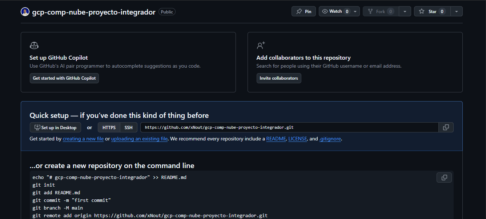
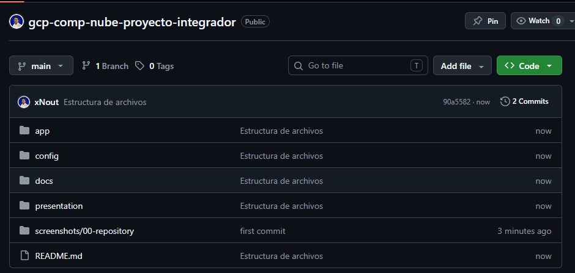
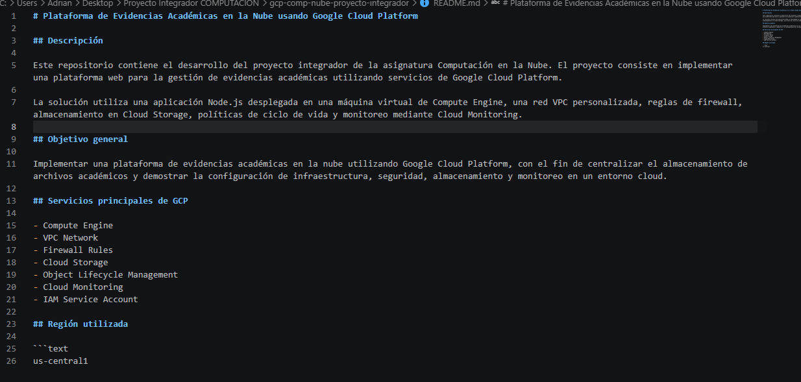
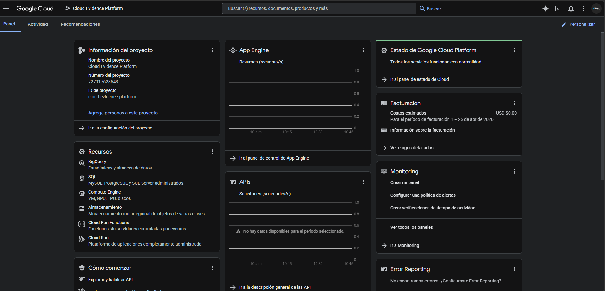
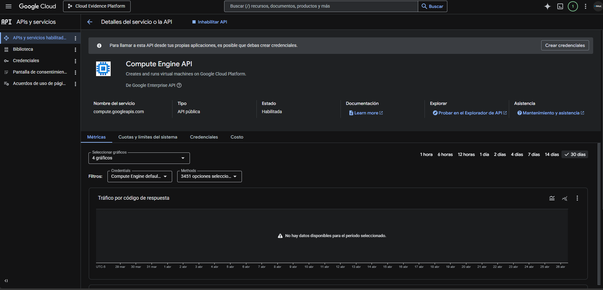
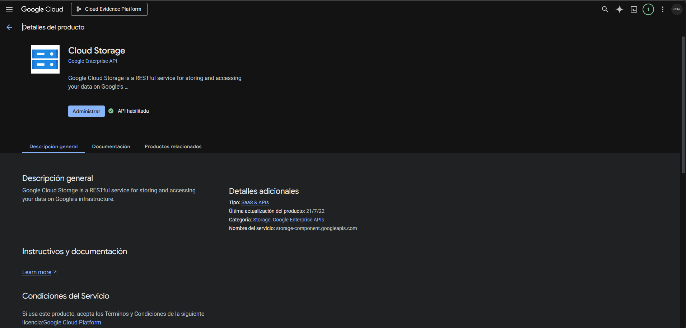
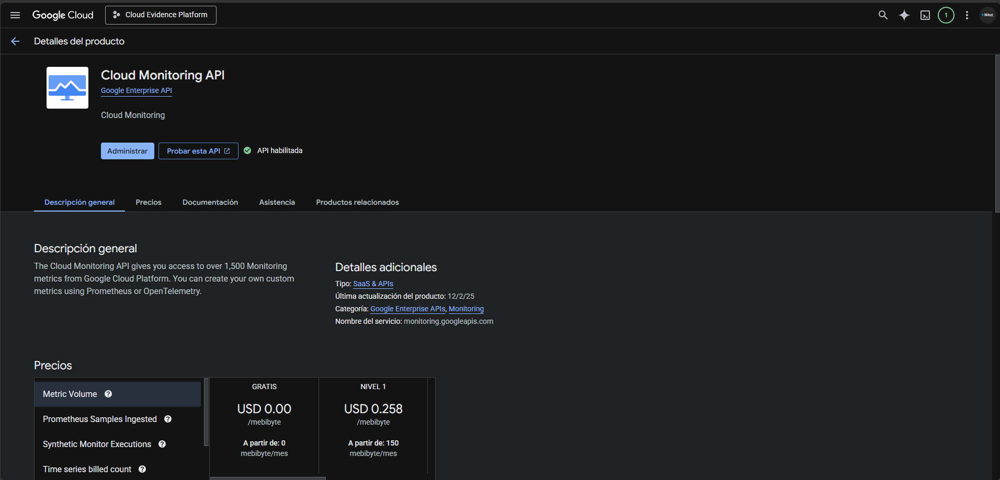
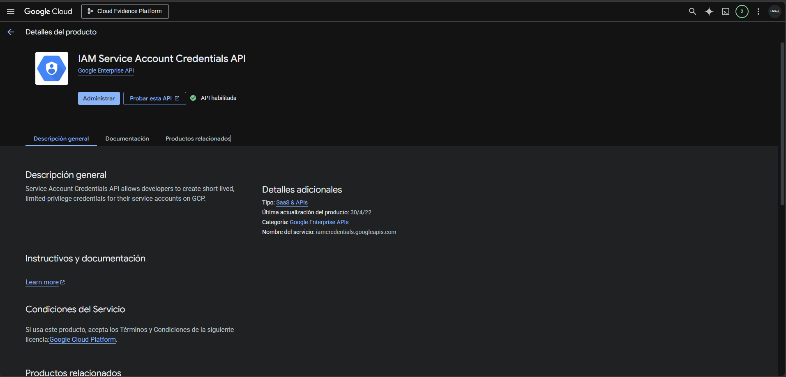
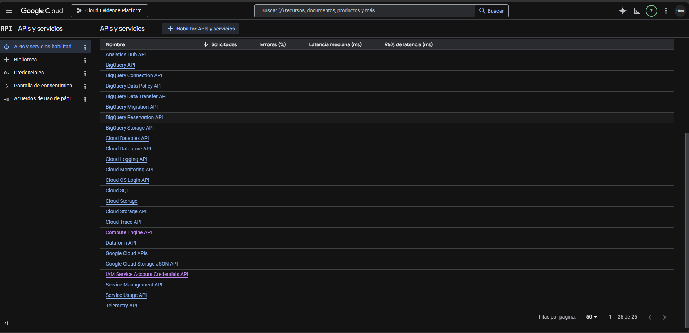

# Plataforma de Evidencias Académicas en la Nube

<p align="center">
  
  
  
  
  
</p>

> Proyecto integrador de la asignatura **Computación en la Nube** — Implementación de una plataforma web para la gestión centralizada de evidencias académicas utilizando servicios de Google Cloud Platform (GCP).

---

## Tabla de contenidos

- [Descripción](#descripción)
- [Objetivo](#objetivo)
- [Características](#características)
- [Arquitectura y stack tecnológico](#arquitectura-y-stack-tecnológico)
- [Requisitos previos](#requisitos-previos)
- [Configuración e instalación local](#configuración-e-instalación-local)
- [Variables de entorno](#variables-de-entorno)
- [Scripts disponibles](#scripts-disponibles)
- [Estructura del proyecto](#estructura-del-proyecto)
- [Endpoints de la aplicación](#endpoints-de-la-aplicación)
- [Seguridad](#seguridad)
- [Despliegue en GCP](#despliegue-en-gcp)
- [Evidencias del proyecto](#evidencias-del-proyecto)
- [Autor](#autor)

---

## Descripción

Este repositorio contiene el desarrollo completo del proyecto integrador, compuesto por:

- **Infraestructura en GCP:** red VPC personalizada, reglas de firewall, cuentas de servicio IAM y monitoreo.
- **Backend / Frontend:** aplicación Node.js con TypeScript, Express y EJS, estilizada con Tailwind CSS v4.
- **Almacenamiento:** integración con Google Cloud Storage mediante la cuenta de servicio de la VM (autenticación implícita).

La solución permite a los usuarios cargar, listar y descargar archivos académicos (PDF, imágenes, Word) de forma segura, con validaciones de tipo y tamaño, sanitización de nombres de archivo y prevención de path traversal.

---

## Objetivo

Implementar una plataforma de evidencias académicas en la nube utilizando **Google Cloud Platform**, con el fin de centralizar el almacenamiento de archivos académicos y demostrar la configuración de infraestructura, seguridad, almacenamiento y monitoreo en un entorno cloud real.

---

## Características

- Carga de archivos académicos con validación de tipo y tamaño máximo configurable.
- Listado de evidencias con metadatos (nombre original, tamaño, fecha de actualización).
- Descarga segura de archivos almacenados en Cloud Storage.
- Organización automática de archivos en el bucket por prefijo, año y mes.
- Interfaz responsiva y moderna con Tailwind CSS.
- Seguridad reforzada con Helmet, sanitización de nombres y autenticación implícita de GCP.
- Monitoreo integrado mediante Cloud Monitoring.

---

## Arquitectura y stack tecnológico

### Infraestructura (GCP)

| Servicio | Uso |
|----------|-----|
| **Compute Engine** | Máquina virtual que aloja la aplicación Node.js |
| **VPC Network** | Red privada personalizada para la VM |
| **Firewall Rules** | Control de tráfico entrante/saliente |
| **Cloud Storage** | Almacenamiento persistente de archivos académicos |
| **Object Lifecycle Management** | Políticas de ciclo de vida en el bucket |
| **Cloud Monitoring** | Observabilidad y métricas del sistema |
| **IAM Service Account** | Gestión de permisos mediante cuentas de servicio |

### Aplicación

| Tecnología | Versión | Descripción |
|------------|---------|-------------|
| Node.js | LTS | Runtime de JavaScript |
| TypeScript | ^5.8.3 | Tipado estático |
| Express | ^4.21.2 | Framework web |
| EJS | ^3.1.10 | Motor de plantillas |
| Tailwind CSS | ^4.1.4 | Framework de estilos |
| Google Cloud Storage | ^7.15.2 | SDK de almacenamiento |
| Helmet | ^8.0.0 | Seguridad de cabeceras HTTP |
| Multer | ^1.4.5 | Manejo de multipart/form-data |

**Región utilizada:** `us-central1`

---

## Requisitos previos

- [Node.js](https://nodejs.org/) (versión LTS recomendada)
- [npm](https://www.npmjs.com/) (incluido con Node.js)
- Proyecto activo en [Google Cloud Console](https://console.cloud.google.com/)
- Bucket de Cloud Storage creado
- APIs habilitadas en GCP:
  - Compute Engine API
  - Cloud Storage API
  - Cloud Monitoring API
  - IAM Service Account Credentials API

---

## Configuración e instalación local

1. **Clonar el repositorio:**

   ```bash
   git clone https://github.com/tu-usuario/gcp-comp-nube-proyecto-integrador.git
   cd gcp-comp-nube-proyecto-integrador/app
   ```

2. **Instalar dependencias:**

   ```bash
   npm install
   ```

3. **Configurar variables de entorno:**

   ```bash
   cp .env.example .env
   # Editar .env con tus valores reales
   ```

4. **Compilar estilos CSS:**

   ```bash
   npm run build:css
   ```

5. **Ejecutar en modo desarrollo:**

   ```bash
   npm run dev
   ```

   La aplicación estará disponible en `http://localhost:3000`.

> **Nota:** Para desarrollo local se requiere un archivo de claves JSON de una cuenta de servicio con permisos de lectura/escritura en Cloud Storage, o configurar el emulador de GCP. En producción (Compute Engine) la autenticación es implícita mediante la cuenta de servicio asociada a la VM.

---

## Variables de entorno

El archivo `.env` debe ubicarse en la carpeta `app/` y contener las siguientes variables:

| Variable | Requerida | Valor por defecto | Descripción |
|----------|:---------:|:-----------------:|-------------|
| `NODE_ENV` | No | `development` | Entorno de ejecución (`development` o `production`) |
| `PORT` | No | `3000` | Puerto en el que escucha la aplicación |
| `GCP_BUCKET_NAME` | **Sí** | — | Nombre del bucket de Cloud Storage |
| `MAX_FILE_SIZE_MB` | No | `10` | Tamaño máximo permitido por archivo (en MB) |
| `GCS_PREFIX` | No | `evidencias` | Prefijo para organizar archivos dentro del bucket |

### Ejemplo de `.env`:

```env
NODE_ENV=development
PORT=3000
GCP_BUCKET_NAME=mi-proyecto-evidencias-bucket
MAX_FILE_SIZE_MB=10
GCS_PREFIX=evidencias
```

---

## Scripts disponibles

Ubicados en `app/package.json`:

| Script | Comando | Descripción |
|--------|---------|-------------|
| `dev` | `tsx watch src/server.ts` | Ejecuta el servidor en modo desarrollo con recarga automática |
| `build` | `tsc` | Compila TypeScript a JavaScript en la carpeta `dist/` |
| `start` | `node dist/server.js` | Inicia la aplicación compilada (producción) |
| `build:css` | `npx @tailwindcss/cli ...` | Compila los estilos de Tailwind CSS una vez |
| `watch:css` | `npx @tailwindcss/cli ... --watch` | Compila CSS en modo observador |

### Flujo de desarrollo recomendado

En dos terminales separadas dentro de `app/`:

```bash
# Terminal 1 - Servidor
npm run dev

# Terminal 2 - Estilos
npm run watch:css
```

### Flujo de producción

```bash
npm run build
npm run build:css
npm start
```

---

## Estructura del proyecto

```text
gcp-comp-nube-proyecto-integrador/
├── app/                          # Aplicación Node.js
│   ├── src/
│   │   ├── config/               # Configuración centralizada
│   │   │   ├── env.ts            # Variables de entorno validadas
│   │   │   ├── app.config.ts     # Configuración general de la app
│   │   │   ├── messages.config.ts # Textos y mensajes de UI
│   │   │   └── theme.config.ts   # Colores y estilos del tema
│   │   ├── routes/               # Definición de rutas
│   │   │   ├── page.routes.ts
│   │   │   └── evidence.routes.ts
│   │   ├── services/             # Lógica de negocio
│   │   │   └── storage.service.ts
│   │   ├── middlewares/          # Middlewares de Express
│   │   │   ├── upload.middleware.ts
│   │   │   └── error.middleware.ts
│   │   ├── utils/                # Utilidades
│   │   │   ├── format.util.ts
│   │   │   └── file-name.util.ts
│   │   ├── views/                # Plantillas EJS
│   │   ├── types/                # Tipos TypeScript
│   │   ├── app.ts                # Configuración de Express
│   │   └── server.ts             # Punto de entrada
│   ├── public/                   # Archivos estáticos
│   │   ├── css/
│   │   └── js/
│   ├── .env.example
│   ├── package.json
│   └── tsconfig.json
├── screenshots/                  # Evidencias del proyecto
│   ├── 00-repository/
│   └── 01-gcp-project/
└── README.md
```

---

## Endpoints de la aplicación

| Método | Ruta | Descripción |
|--------|------|-------------|
| `GET` | `/` | Página principal |
| `GET` | `/upload` | Formulario de carga de archivos |
| `POST` | `/upload` | Procesa y sube archivo a Cloud Storage |
| `GET` | `/evidences` | Lista las evidencias almacenadas |
| `GET` | `/evidences/:encodedName/download` | Descarga un archivo específico |
| `GET` | `/health` | Verificación de estado (health check) |

---

## Seguridad

- **Helmet:** Configura cabeceras HTTP seguras por defecto.
- **Validación de archivos:** Solo se permiten tipos MIME específicos (`application/pdf`, `image/png`, `image/jpeg`, `application/vnd.openxmlformats-officedocument.wordprocessingml.document`).
- **Límite de tamaño:** Configurable mediante `MAX_FILE_SIZE_MB`.
- **Sanitización de nombres:** Los nombres de archivo se limpian para evitar caracteres peligrosos.
- **Prevención de path traversal:** La aplicación valida y rechaza rutas maliciosas.
- **Sin claves en el repositorio:** Ni `.env` ni archivos JSON de credenciales son versionados.
- **Autenticación implícita en GCP:** En Compute Engine se utiliza la cuenta de servicio de la VM, eliminando la necesidad de claves JSON en producción.
- **Bucket privado:** El acceso a los objetos se realiza únicamente a través de la aplicación.

---

## Despliegue en GCP

### Requisitos en la infraestructura

1. **Crear proyecto** en Google Cloud Console.
2. **Habilitar APIs** necesarias (Compute Engine, Cloud Storage, Cloud Monitoring, IAM).
3. **Crear bucket** de Cloud Storage en la región `us-central1`.
4. **Crear red VPC** y reglas de firewall para permitir tráfico HTTP/HTTPS en el puerto de la aplicación.
5. **Crear instancia de Compute Engine** (preferiblemente con Debian/Ubuntu) dentro de la VPC.
6. **Asignar cuenta de servicio** a la VM con los roles:
   - `roles/storage.objectAdmin` (para el bucket específico)

### Pasos en la VM

```bash
# 1. Clonar el código
git clone https://github.com/tu-usuario/gcp-comp-nube-proyecto-integrador.git
cd gcp-comp-nube-proyecto-integrador/app

# 2. Instalar dependencias
npm install --production

# 3. Configurar variables de entorno
nano .env
# GCP_BUCKET_NAME=nombre-del-bucket
# PORT=3000
# NODE_ENV=production

# 4. Compilar la aplicación
npm run build
npm run build:css

# 5. Iniciar con PM2 o systemd
npm start
```

### Producción robusta (recomendado)

Para un entorno productivo se recomienda:

- Usar **PM2** o **systemd** para mantener el proceso activo.
- Configurar **Nginx** como reverse proxy con SSL/TLS.
- Implementar **Cloud Load Balancer** para alta disponibilidad.
- Configurar **alertas** en Cloud Monitoring para uptime y errores.

---

## Evidencias del proyecto

A continuación se documentan las capturas de pantalla del avance del proyecto:

### Repositorio y estructura inicial

| # | Evidencia |
|---|-----------|
| 1 |  |
| 2 |  |
| 3 |  |

### Configuración del proyecto en GCP

| # | Evidencia |
|---|-----------|
| 4 |  |
| 5 |  |
| 6 |  |
| 7 |  |
| 8 |  |
| 9 |  |

---

## Autor

Desarrollado como parte del **Proyecto Integrador** de la asignatura *Computación en la Nube*.

---

<p align="center">
  <strong>Google Cloud Platform</strong> · <strong>Node.js</strong> · <strong>TypeScript</strong> · <strong>Express</strong>
</p>
